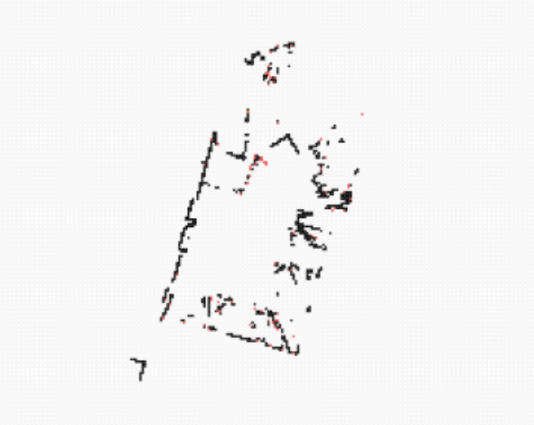

# Irobot Occupancy Grid Mapping

This project uses roslibpy lidar and odometry in order to map the surrounding area on an occupancy grid.

## Table of Contents

- [About](#about)
- [Dependencies](#dependencies)
- [Usage](#usage)
- [Acknowledgements](#acknowledgements)
  

## About

The purpose of this project is to accompish a task for the EW458 Final. However, if further optimized, the utilization of robots to map an area could be implemented to access or observe areas that may be blocked off or dangerous for people to enter. For example, cave exploration or scouting an area. 
As mentioned above, this project uses roslibpy in order to subscribe to the lidar and odometry sensors on the robot, and publish the resulting occupancy grid.

A screenshot of the resulting occupancy grid is shown above. The map is designed to update over time so any changes made to its surroundings will be reflected on the map. 

## Dependencies

Clone the respository  

git clone https://github.com/sydmola/EW458_Final  

install roslibpy  

  pip install roslibpy  

install numpy  

  pip install numpy

## Usage

This code is designed to be used with ros in order to access lidar and odometry. These capabilities will be needed in order to utilize the code. Additionally, this Github does not include a website subscriber in order to view the occupancy grid. The one used in the creation of this project is reliant on the wifi so that ros can connect to the robot. 

The driving code and the mapping code should be run at the same time if moving the robot is desired.

## Acknowledgements

We would like to thank our lovely robot, India, for implementing our code and helping us troubleshoot.
